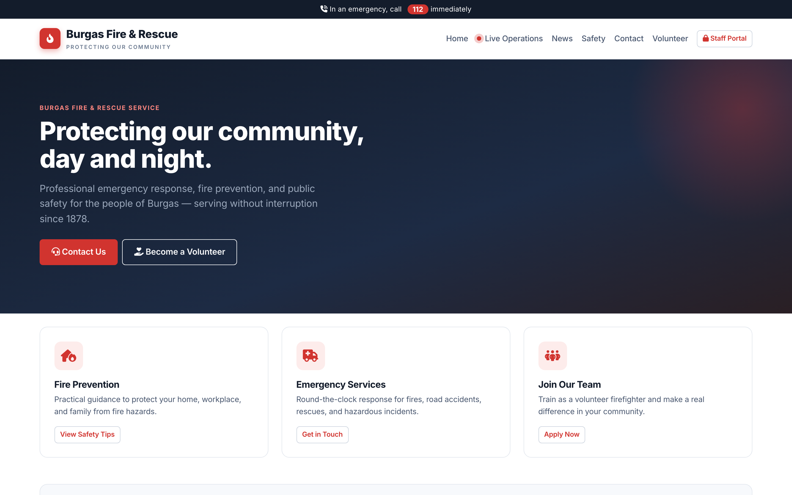
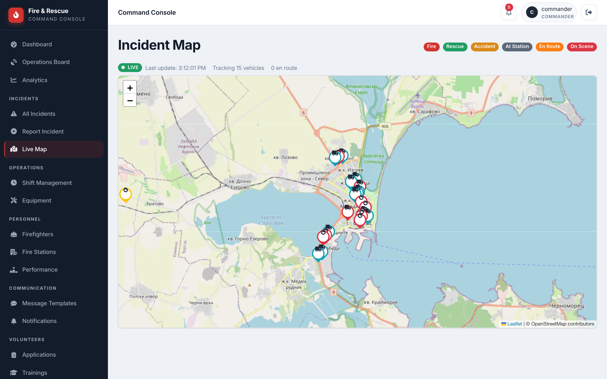
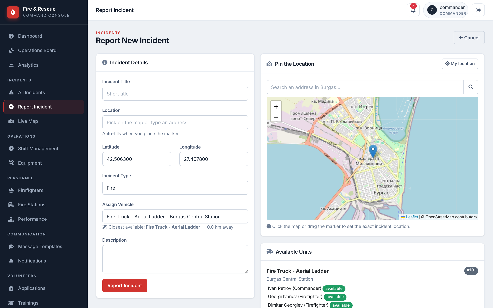
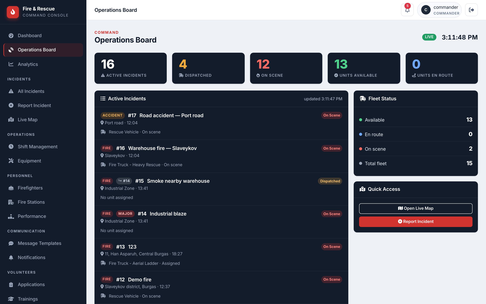
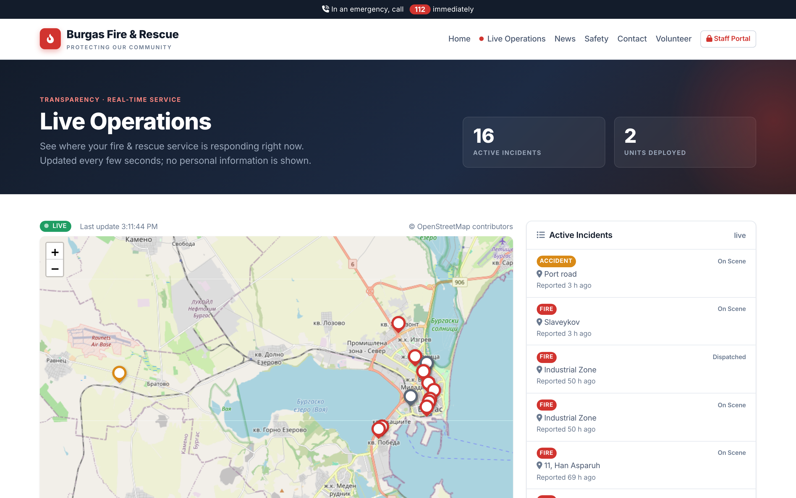
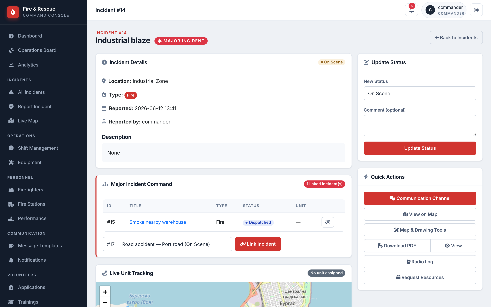
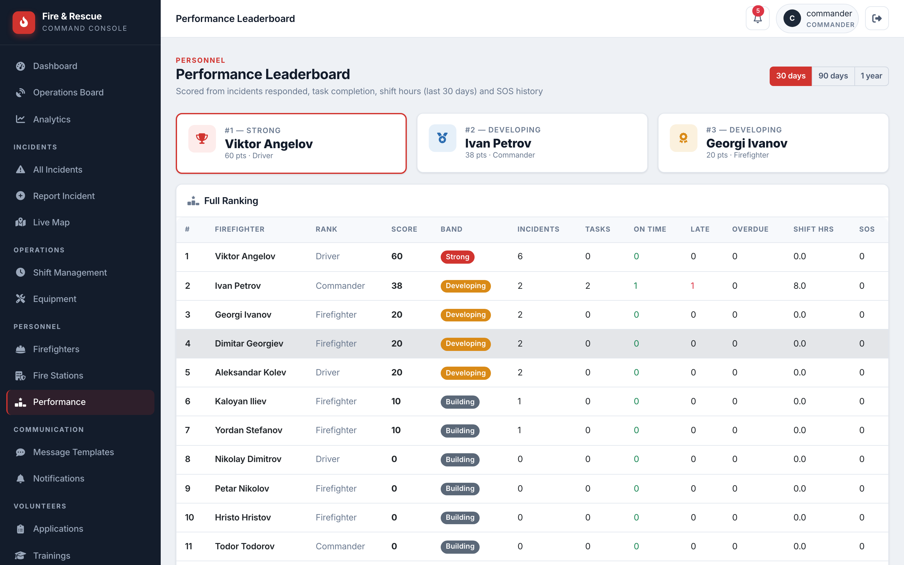
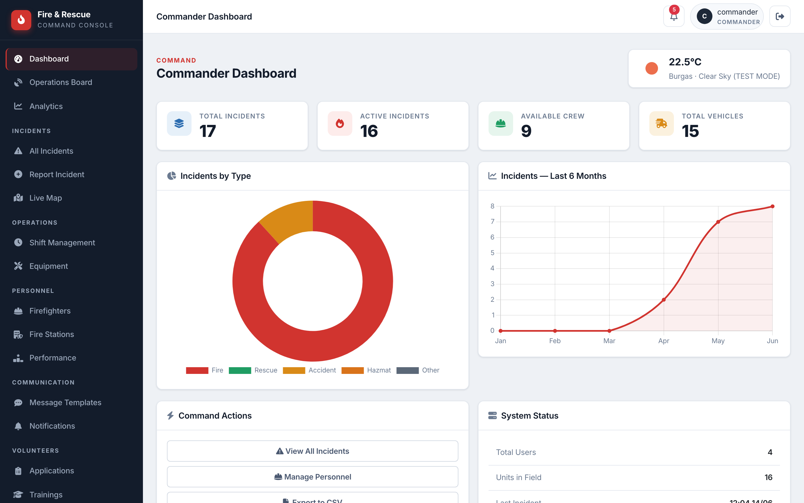

[](https://classroom.github.com/a/RlRKNPRa)

# 🚒 Fire & Rescue Command System

> A real-time emergency dispatch and operations platform for the Burgas Fire &
> Rescue Service. Report an incident, dispatch the nearest unit, and watch it
> drive there live along real roads — with a public transparency map for citizens.

[](https://flask.palletsprojects.com/)
[](https://www.python.org/)
[](https://www.openstreetmap.org/)



---

## What it is

A full-stack web application that models how a modern fire department actually
runs its operations. It has **four user roles**, each with its own view of the
system:

| Role | What they do |
|---|---|
| **Public** | Browse safety info, apply to volunteer, file non-emergency reports, and watch the **live operations map** |
| **Firefighter** | See assigned incidents, update their status, trigger an SOS, use incident chat |
| **Dispatcher** | Report incidents, dispatch units, run the Operations Board, manage resources |
| **Commander** | Everything above + analytics, personnel, performance leaderboard, major-incident command |

The public website lives at `/`; the staff console is behind `/staff/login`.

---

## Standout features

### 🛰️ Live road-route dispatch
When a unit is dispatched, the system computes a **real driving route** along
actual streets (via the free OpenStreetMap OSRM router — no API key) and animates
the vehicle along it with a live, counting-down ETA. The position is computed
server-side from elapsed time, so units keep moving even if you reload the page.



### 🗺️ Click-to-pin incident reporting
No more typing coordinates blindly. Drag a marker, click the map, search an
address, or use your GPS — the coordinates **and** the street address fill in
automatically (reverse geocoded). The form then **suggests the closest available
unit** to dispatch.



### 📟 Operations Board — the command wall
A dark, auto-refreshing situational-awareness screen: live KPIs, active incidents
with ETA progress bars, fleet status, and an SOS alert strip. Built to be put on
a big monitor in a dispatch room.



### 🌍 Public live operations map
A transparency feature real fire services offer: citizens can see where the
service is responding **right now**, at `/live` — no login. The same live engine
drives it, but a **privacy filter at the API boundary** strips every piece of
sensitive data (crew names, vehicle IDs, SOS detail) and coarsens addresses.



### 🧯 Major-Incident command structure
A commander can declare a **Major Incident** and link related incidents under it,
forming one command structure where all units report to a single commander.



### 🏆 Performance leaderboard
Firefighters are scored from real operational data — incidents responded to,
tasks completed on time, shift hours, SOS history — and ranked for the commander.



### …and the rest
Auto "On Scene" detection on arrival · automatic crew-status sync · incident
timeline with response metrics · SOS / Mayday button with geolocation · real-time
SSE notifications · weather at incident locations · PDF incident reports · CSV
export · equipment checkout/return · shift management · volunteer applications &
training enrollment · analytics dashboard with charts.



---

## Tech stack

| Layer | Technology |
|---|---|
| **Backend** | Python 3.12+, Flask, Flask-SQLAlchemy, Flask-WTF |
| **Database** | SQLite (dev) — PostgreSQL-ready via `DATABASE_URL` |
| **Frontend** | Bootstrap 5, Leaflet.js, Chart.js, Font Awesome, Inter |
| **Live routing** | OSRM (OpenStreetMap) — real road routes, **no API key** |
| **Geocoding** | Nominatim (OpenStreetMap) — **no API key** |
| **Weather** | OpenWeatherMap (optional; mock data fallback) |
| **PDF** | ReportLab |
| **Real-time** | Server-Sent Events (notifications) + polling (live map) |

**Architecture**: app-factory pattern, blueprints split by domain, models/forms/
routes split by domain, role-based access decorators, and a lightweight SQLite
auto-migration that adds new columns without dropping data.

---

## Quick start

```bash
# 1. Clone and enter the project
git clone <repo-url>
cd iara-gdbpzn-VATenev23

# 2. Create a virtual environment
python3 -m venv .venv
source .venv/bin/activate          # Windows: .venv\Scripts\activate

# 3. Install dependencies
pip install -r requirements.txt

# 4. (Optional) configure environment
cp .env.example .env               # then edit if you want a real SECRET_KEY / weather key

# 5. Run
python run.py
```

Open **http://localhost:5000** (the app picks another port automatically if 5000
is taken — on macOS, AirPlay Receiver holds 5000).

### First-time setup (60 seconds)

1. Visit **`/create-commander`** once → creates the admin account
   `c@fire.bg` / `123456`.
2. Log in at **`/staff/login`**.
3. Visit **`/staff/import-data`** to load 15 vehicles + 15 firefighters.
4. Visit **`/staff/equipment/import`** to load default equipment.

You're ready.

---

## Project structure

```
app/
├── __init__.py          # app factory, DB init, auto-migration, error handlers
├── utils.py             # routing engine, arrival processing, decorators, PDF
├── models/              # SQLAlchemy models (split by domain)
├── forms/               # WTForms (split by domain)
├── routes/              # blueprints: public, auth, dashboard, incidents,
│                        #   firefighters, equipment, volunteers, stations,
│                        #   map, communications, notifications
├── templates/
│   ├── public/          # public website + live operations map
│   └── staff/           # the command console (sidebar layout)
└── static/css/          # theme.css, main.css, responsive.css
config.py                # configuration (env-driven)
data.py                  # sample fleet + personnel
run.py                   # entry point
requirements.txt
```

---

## Notes

- **No API keys required** for the core experience — routing and geocoding use the
  free public OpenStreetMap services. Weather works with mock data if no key is set.
- The SQLite database (`instance/database.db`) is created automatically on first run.
- For development convenience, `ROUTE_SIM_SPEEDUP` in `app/utils.py` compresses
  travel time so demos are watchable; the **displayed ETA remains the real driving
  time**.

---

*Built as a software engineering capstone project for the Burgas Fire & Rescue
Service.*